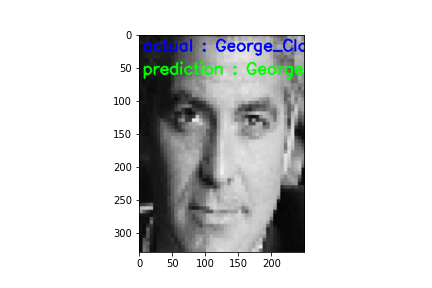
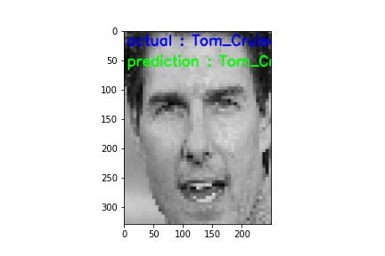
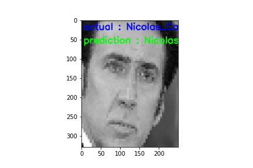
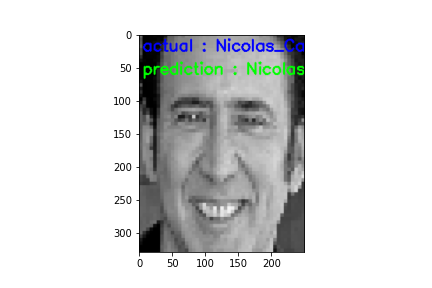
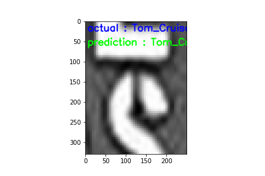

# 👱‍♂️Local-Binary-Patterns-Face-Recognition
-------

  
  
  
  

### 📄Description
---
One of the main problems in computer vision field is face recognition. If we take a look at the past, we can find that building and deploying an accurate face recognition algorithms was very challenging and time consuming. Since then many face recognition algorithms were made and implemented; such as : `Eigenfaces/Eigenvector algrithms` , `Local Binary Patterns` or `LBPs` is short and even deep learning based face recognition algorithms were even introduced such as `Siamese Networks`. In this repository our purpose is that to implement not a state-of-art but a fairly accurate face recognition algorithmm based on the local binary patterns methodlogy.

### ⚡Face Recognition vs Face Detection
---
First of all it has to be mentioned that `face detection` and `face recognition` are completely two different terminologies. With face detection, as its name suggests, we can detect and localize available face(s) in an image.Face detection algorithm tells you that where is the face exactly in the image.But on the other hand, a face recognition algorithm is a different algorithm. face recognizer gets the ROI of the image where the face is exactly located on that region and performs some actions on the ROI and then identifies the person that this face belongs to.

We have various methods to detect and extract face(s) in the image, some of them are `Haar Cascades` , `OpenCV's deep learning based face detector` , `HOG + Linear SVM` and etc. We choose `Haar Cascade` algorithm over other techniques because: 1. It has very small size (< 1 MB) it needs low computational power and very fast(even it can be used for real-time projects. This algorithm like many other algorithms has some drawbacks.One of them is that, it maybe (in some specific situations) will produce some false positives.The other draw back is that this model has many parameters to tune. So you have to fine-tine its parameters to produce least false positive.The figure down below shows one of the false positives that this model produced during the project.

  

