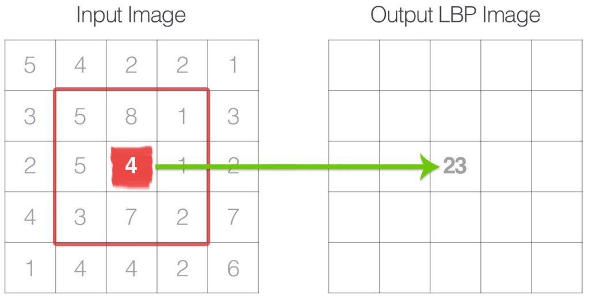

# 👱‍♂️Local-Binary-Patterns-Face-Recognition
-------
<p float="left">
  
  
  
  
</p>

### 📄Description
---
One of the main problems in computer vision field is face recognition. If we take a look at the past, we can find that building and deploying an accurate face recognition algorithms was very challenging and time consuming. Since then many face recognition algorithms were made and implemented; such as : `Eigenfaces/Eigenvector algrithms` , `Local Binary Patterns` or `LBPs` is short and even deep learning based face recognition algorithms were even introduced such as `Siamese Networks`. In this repository our purpose is that to implement not a state-of-art but a fairly accurate face recognition algorithmm based on the local binary patterns methodlogy.

### 🔴Contents & Folder Structures
---

### ⚡Face Recognition vs Face Detection
---
First of all it has to be mentioned that `face detection` and `face recognition` are completely two different terminologies. With face detection, as its name suggests, we can detect and localize available face(s) in an image.Face detection algorithm tells you that where is the face exactly in the image.But on the other hand, a face recognition algorithm is a different algorithm. face recognizer gets the ROI of the image where the face is exactly located on that region and performs some actions on the ROI and then identifies the person that this face belongs to.

We have various methods to detect and extract face(s) in the image, some of them are `Haar Cascades` , `OpenCV's deep learning based face detector` , `HOG + Linear SVM` and etc. We choose `Haar Cascade` algorithm over other techniques because: 1. It has very small size (< 1 MB) it needs low computational power and very fast(even it can be used for real-time projects. This algorithm like many other algorithms has some drawbacks.One of them is that, it maybe (in some specific situations) will produce some false positives.The other draw back is that this model has many parameters to tune. So you have to fine-tine its parameters to produce least false positive.The figure down below shows one of the false positives that this model produced during the project.

<p align="center">
  
</p>

### 🔄Local Binary Patterns Process
---
Local Binary Patterns or `LBP` in short, is a texture descriptor. LBPs compute a local representation of texture. This local representation is constructed by comparing each pixel with its surrounding neighborhood of pixels.

To implement LBP text descriptor, first we have to convert input image into a gray scale image, then for each pixel we consider a neighborhood of size `r` surrounding the center pixel.

To calculate LBP for the neighborhood pixels, first we have to consider their values with compare to the center pixel value. If the intensity value of the neighborhood pixel is equal to or greater than the intensity value of the center pixel, then we set the neighborhood pixel value to `1`; Otherwise we set it to `0`.

<p align="center">
  
</p>

To implement, we can start by any neighborhood pixels. We can choose neighborhood pixels with `clock-wise` order or vice versa. Keep in mind that, you have to keep the same order for every image ROI and every image in dataset.

<p align="center">
  
</p>

After calculating the neighborhood pixel values in terms of the center pixel, we have to perform a binary test. The results of the binary tests will be saved in an 8-bit array(for `3x3` neighborhood) and then we convert these array values into decimal format. After calculating the sum of decimals, we replace this value with the center pixel intensity value. After doing this process and computing the sum of decimals and replacing it with center pixel for all of the pixels in the image; we can get the LBP output image.

<p align="center">
  
</p>

This picture down below shows the final image after converting it into LBP format. The histogram next to it shows the intensity value distribution for all of the available pixels in the image.

<p>
  
  
</p>

LBP algorithm, instead of looking into the entire image, it first divide the whole image into a `SxS` grid. Then this algorithm convert each grid into the `LBP` format and obtain the intensity distribution of that particular grid. After doing this process, this model produces `S^2` histogram. After doing that, the model concatnate all of the produced histograms. Then we perform `KNN` algorithm (with `K=1`) and by \chi^{2} distance we find the closest face in the dataset and display the corresponding person name in the output.

<p align="center">
  
</p>

### 📐Model Performance
---

### 💻Installation
---
The Code is written in Python 3.7.5. If you don't have Python installed you can find it [here](https://www.python.org/downloads/). If you are using a lower version of Python you can upgrade using the pip package, ensuring you have the latest version of pip. To install the required packages and libraries, run this command in the project directory after cloning the repository:
```
git clone git@github.com:Kasra1377/flight-fare-prediction.git
```
or
```
git clone https://github.com/Kasra1377/flight-fare-prediction.git
```
To install required libraries just type:
```
pip install -r requirements.txt
```

### ⚙Technologies Used
---


[](https://scikit-learn.org/stable/) [](https://numpy.org/) [](https://docs.opencv.org/) 

### ❌Bugs & Issues
---
If you ever encountered any bugs in this projects or any technical issues you can report it by `issues` section of this repository or you can contact me by my email address. 


### 👥Contributers
---
Kasra1377
